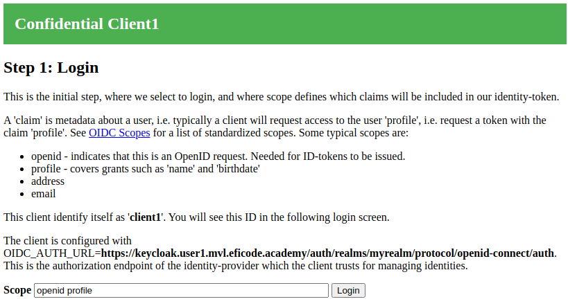
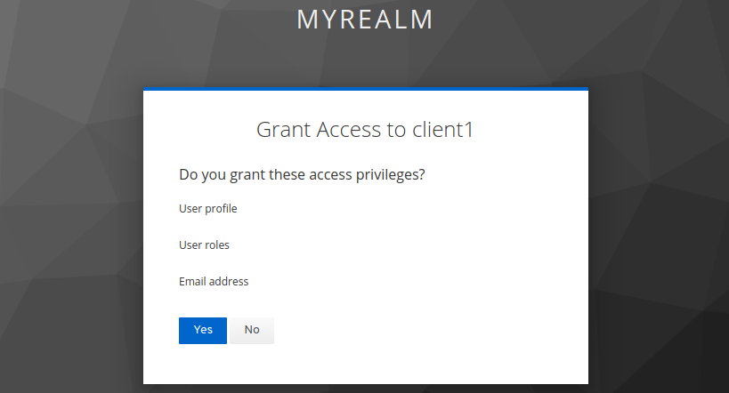
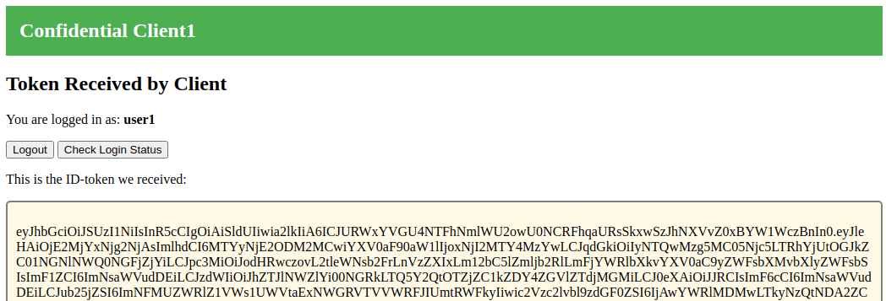

# Authorization Code Flow - Part 1

## Learning Goals

- high-level hands-on with the authorization code flow
- Configure a client to work with an OIDC identity provider
- Using the OIDC discovery endpoint
- Decoding ID-tokens/JWTs

## Introduction

This exercise demonstrate OIDC login using a server-based client also
known as a 'confidential client'. Login will be implemented using the
'authorization code flow', which is the recommended approach for most
situations.

## Prerequisites

This exercise use the following environment variables. They will
already be configured for Eficode-run trainings:

```
STUDENT_NUM
TRAINING_NAME
CLIENT1_ID
CLIENT1_SECRET
```

Use the following command to inspect your environment variables:

```console
env | egrep 'STUDENT_NUM|TRAINING_NAME|^CLIENT[12]_|^SPA_|^OIDC_' | sort
```

Exercises assume you have changed to the katas folder:

```console
cd oidc-oauth2-katas
```

## Exercise

The authorization and get-token URLs will be obtained from our
authorization server using 'OIDC Discovery' which is a mechanism to
allow OIDC Authorization servers to publish information on well-known
URLs.

Assuming your KeyCloak instance is located at:

```
https://keycloak.student<X>.<training-name>.eficode.academy
```

then you can fetch the OIDC configuration for the realm `myrealm` with:

```console
curl -s https://keycloak.student$STUDENT_NUM.$TRAINING_NAME.eficode.academy/auth/realms/myrealm/.well-known/openid-configuration | jq .
```

Specifically, the authorization and token URLs can be found with:

```console
curl -s https://keycloak.student$STUDENT_NUM.$TRAINING_NAME.eficode.academy/auth/realms/myrealm/.well-known/openid-configuration | jq .authorization_endpoint
curl -s https://keycloak.student$STUDENT_NUM.$TRAINING_NAME.eficode.academy/auth/realms/myrealm/.well-known/openid-configuration | jq .token_endpoint
```

Export the URLs as environment variables:

```console
export OIDC_AUTH_URL=`curl -s https://keycloak.student$STUDENT_NUM.$TRAINING_NAME.eficode.academy/auth/realms/myrealm/.well-known/openid-configuration | jq -r .authorization_endpoint`
export OIDC_TOKEN_URL=`curl -s https://keycloak.student$STUDENT_NUM.$TRAINING_NAME.eficode.academy/auth/realms/myrealm/.well-known/openid-configuration | jq -r .token_endpoint`
```

With the required settings stored as environment variables as
described above, you are ready to deploy the client. To see the
configured settings use:

```console
env | egrep 'OIDC|CLIENT[12]_' | sort
```

We will deploy the server-based client using Kubernetes and the client will be accessible at the URL below.

```console
export CLIENT1_BASE_URL=https://client1.student$STUDENT_NUM.$TRAINING_NAME.eficode.academy
echo $CLIENT1_BASE_URL
```

For the Kubernetes deployment, we make the above configuration
available as a `ConfigMap` and `Secret`. Use the commands below to
create these:

```console
kubectl create secret generic client1 \
    --from-literal=client_id=$CLIENT1_ID \
    --from-literal=client_secret=$CLIENT1_SECRET
kubectl create configmap client1 \
    --from-literal=oidc_auth_url=$OIDC_AUTH_URL  \
    --from-literal=oidc_token_url=$OIDC_TOKEN_URL \
    --from-literal=client_base_url=$CLIENT1_BASE_URL
```

With the configuration in place, we are ready to deploy the client. Use the following to deploy the client:

```console
kubectl apply -f kubernetes/client1.yaml
```

When the client POD is `Running`, visit the client at the URL you
stored in environment variable `CLIENT1_BASE_URL`. You should see
something like:

> 

This client explicitly shows the scopes it will request from the
identity provider. Many clients do not show this to the end-user. The
default scope `openid profile` means *'do an OIDC login and give us
access to user profile'*.

Click login with the default scope setting and you will be redirected
to the identity provider where you can login. If you followed the
[Setting up KeyCloak](setting-up-keycloak.md) guide, use the username
and password you specified for one of the test users. Also, the
KeyCloak guide enabled consent-request, i.e. you will be presented
with a consent screen:

> 

Note that you are being asked about granting access to a specific
client. Not all client/identity-provider setups include this,
i.e. they will skip this step and immediately issue token.

Click 'Yes' to grant the client access.

When login is completed, you are redirected back to the client, and
the client will display the content of the ID token it received
(i.e. the 'claims' which the identity provider asserts are true):

> 

The client shows both the raw ID token and the decoded claims. We can
decode the JWT token ourself using the command line. This is often
useful during debugging.  To decode the token manually, copy
the raw token and store it in an environment variable:

```console
export IDTOKEN=<raw token data>
echo $IDTOKEN | cut -d. -f2 | base64 -d | jq .
```

> If you get an `base64: invalid input` warning from this command then its most likely because the base64 encoded data is not a multiple of 4 characters. I.e. the output from `cut` needs to be padded with a number of `=` characters. This warning is however, safe to ignore.

This completes part-1 of the confidential client authorization code
flow. In [Part-2](authorization-code-flow2.md) we will look more into
the details of the token exchange.

### Clean up

**If you are planning to continue to part-2, postpone the cleanup
until after you have done part-2.**

```console
kubectl delete -f kubernetes/client1.yaml
kubectl delete secret client1
kubectl delete configmap client1
```
