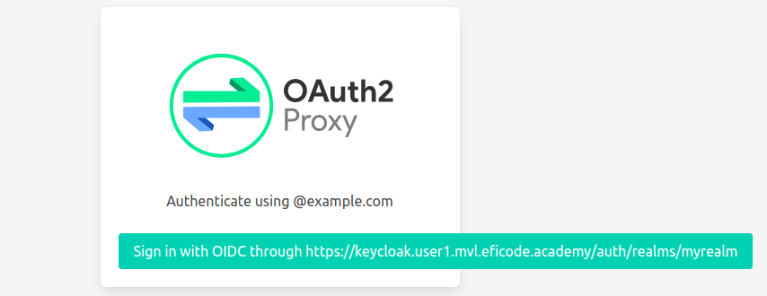
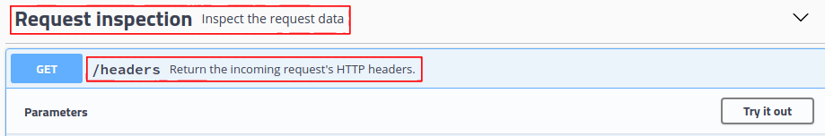

# Using Authorizing Proxies

## Learning Goals

- Understand and use the *authorizing proxy* architectural pattern
- Deploy [OAuth2 proxy](https://github.com/oauth2-proxy/oauth2-proxy) with Helm configured to authenticate users from an OIDC provider.
- Configuring our application as an upstream service protected behind the authorizing proxy.

## Introduction

In exercise [Protecting Resources and APIs](protecting-apis.md) the
OIDC/OAuth2 authorization code flow was implemented using a NodeJS
Express middleware, i.e. a module imported into the application
itself.

This exercise demonstrate an architectural pattern, where the
OIDC/OAuth2 authorization flow and session cookie management is moved
out from the application itself and into the surrounding
infrastructure.

The application will be protected by the authorizing proxy, which only
allow authenticated and/or authorized traffic towards the
application. Moving this functionality out from the application have
some benefits:

- The authentication and/or authorization can be generalized and not every application need to implement it.
- Having a single secure entry point for our application makes it more likely that we 'get security right' compared to if we have multiple services and we need to test and verify all implementations of security.

However, there is also some drawbacks

- Authentication and authorization policies are dictated by what the authorizing proxy supports, i.e. it may be difficult to implement fine-grained policies.
- The proxy may be deployed/managed by a different team than the service it protects, i.e. changing policies or debugging access issues could become more difficult due to slow turn-around time or missing access to e.g. proxy logs.

## Exercise

The authorizing proxy will pass authentication/authorization details
to our upstream application through HTTP headers. To inspect these we
will for this exercise use the
[httpbin](https://github.com/postmanlabs/httpbin) tool as the
application we protect. In the following exercise [Protecting against
CSRF Attacks](csrf-attacks.md) we will use our own object store
service protected by the authorizing proxy to demonstrate that the
proxy does not protect against such attacks.

For this exercise we will configure OAuth2 proxy only to allow 'users
with validated emails in the domain `example.com` to access the
protected service'.

Deploy `httpbin` with:

```console
kubectl apply -f kubernetes/httpbin.yaml
```

This creates a Kubernetes deployment and service (named `httpbin`),
however, this service is only accessible inside the kubernetes
cluster.

Next we deploy OAuth2 proxy in front of httpbin to provide this
external access.

Next, set some environment variables with your personal values:

```console
export USER_NUM=<X>             # Use your assigned user number
export TRAINING_NAME=<xxx>      # Get this from your trainer
export CLIENT1_ID=client1       # Change this if you didn't use this client name
export CLIENT1_SECRET=<xxx>     # This is your client1 'credential'
```

From the values above, define the following environment variable:

```console
export OIDC_ISSUER_URL=https://keycloak.user$USER_NUM.$TRAINING_NAME.eficode.academy/auth/realms/myrealm
```

Since OAuth2-proxy will interact with the identity-provider at
`OIDC_ISSUER_URL` to authenticate users, we will have to create a
secret with the client ID and secret. Also, OAuth2-proxy will manage a
session through signed cookies, i.e. it requires a secret for cookie
signatures. Thus, we create a secret for OAuth2-proxy with:

```
kubectl create secret generic client1 \
    --from-literal=client-id=$CLIENT1_ID \
    --from-literal=client-secret=$CLIENT1_SECRET \
    --from-literal=cookie-secret=abcdefgh12345678
```

Externally we make OAuth2 proxy available at our externally available
`client1` DNS sub-domain and we want the 'upstream' (the service
behind OAuth2 proxy) to be the Kubernetes-internal DNS name
`httpbin`. I.e. setup the two URLs as environment variables:

```console
export OAUTH2_PROXY_EP=https://client1.user$USER_NUM.$TRAINING_NAME.eficode.academy
export OAUTH2_PROXY_UPSTREAM=http://httpbin:80
```

Next we configure OAuth2-proxy Helm chart values with URLs from the
environment variables above:

```console
cat kubernetes/oauth2-proxy-values.yaml | envsubst > my-values.yaml
cat my-values.yaml
```
Inspect the generated Helm chart values.

Knowing that OAuth2-proxy implements the OIDC authorization code flow,
the `oidc_issuer_url` and `redirect_url` parameters should look
familiar.

The `upstreams` parameter is the service behind the proxy, i.e. this is
our `httpbin` Kubernetes service.

Finally, the `email_domains` parameter is the authorization policy
that OAuth2-proxy applies, i.e. any user with a verified email from
the given domain are authorized to access the protected service.

Next, install OAuth2-proxy with Helm:

```console
helm repo add oauth2-proxy https://oauth2-proxy.github.io/manifests
helm install client1 oauth2-proxy/oauth2-proxy --values my-values.yaml
```

Finally, you can login through OAuth2 proxy by opening the URL we
stored in the `OAUTH2_PROXY_EP` environment variable above. You should
see something like:

> 

If you login with one of the users [you
created](setting-up-keycloak.md) with a verified email in the domain
`example.com` you should now see the `httpbin` service. Select the
`Request Inspection` and `/headers` option as shown below:

> 

Select the `GET` and `Try it out` buttons and finally `Execute`. This
will trigger a request to `httpbin` that returns in the `Response
body` and headers `httpbin` received on the incoming request. This
allow us to see the metadata passed from OAuth2-proxy to our upstream
service. In the `Response body` we should see the following
information which is userdata OAuth2-proxy obtained from the OIDC
login:

```
    ...
    "X-Forwarded-Email": "user1@example.com",
    "X-Forwarded-Preferred-Username": "user1",
    "X-Forwarded-User": "ea62d4cb-dc5e-4c7b-8ab3-4f166e4b9c17"
```

We saw above, that the authorization policy used by OAuth2 proxy was
that users should have an email in the domain `example.com`.

Next, to show that this is in fact the policy used by OAuth2 proxy,
try out the following two scenarios, which we expect to be unable to
access the protected service:

- A user with an un-verified email
- A user with an email in another domain, e.g. `@notexample.com`

Before trying these, you need to sign-out in OAuth2-proxy.

To sign-out in OAuth2 proxy, you can access the URL stored in
`OAUTH2_PROXY_EP` and appending `/oauth2/sign_out`.

```console
echo "Sign out URL: $OAUTH2_PROXY_EP/oauth2/sign_out"
```

This will,
however, only clear the OAuth2 proxy session. To also logout from the
KeyCloak session, use the KeyCloak interface as we did in the [Using
Tokens](using-tokens.md) exercise.

<details>
<summary>:bulb: Implementing full logout</summary>
It is possible to logout from both OAuth2 proxy and KeyCloak by appending a redirection URL to the `/auth2/sign_out` URL. See https://oauth2-proxy.github.io/oauth2-proxy/docs/features/endpoints/#sign-out.
</details>

### Clean up

```console
helm delete client1
kubectl delete secret client1
kubectl delete -f kubernetes/httpbin.yaml
```
