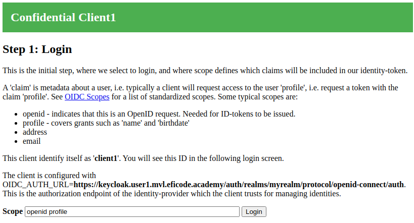
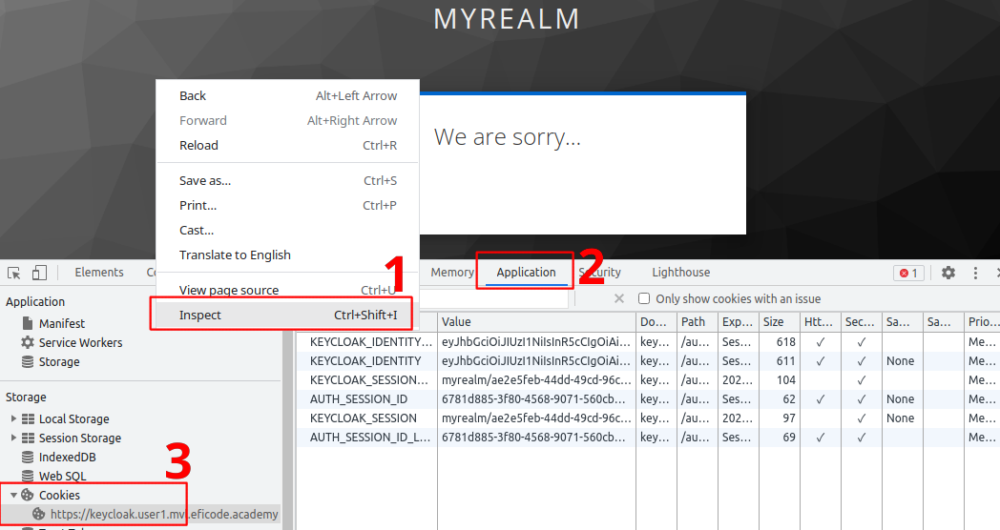

# Confidential Client with Authorization Code Flow

## Learning Goals

- Hands-on with the requests and responses of the authorization code flow
- Configure a confidential client to work with an OIDC identity provider
- Using the OIDC discovery endpoint
- Decoding ID-tokens/JWTs
- Understanding the Context of a login-session
- Investigate identity provider session cookies
- Single-sign-on (SSO) using a second client

## Introduction

This exercise demonstrate OIDC login using a server-based client also
known as a 'confidential client'. Login will be implemented using the
'authorization code flow', which is the recommended approach for most
situations.

## Prerequisites

This exercise require an identity provider configured with one or more
test users and a client configuration that allow our client to login
users through the identity provider. See e.g. [Setting up
KeyCloak](setting-up-keycloak.md) for how to configure KeyCloak for
this exercise.

Specifically we will obtain and configure the following properties:

- A client ID
- A client secret
- An authorization URL
- A token URL

The two first you should know from your identity provider
configuration (e.g. from setting up KeyCloak as described above).

For convenience, export the settings as environment variables:

```console
export CLIENT1_ID=client1
export CLIENT1_SECRET=<xxx>     # This is your client1 'credential'
```

The two URLs will be obtained from our authorization server using
'OIDC Discovery' which is a mechanism to allow OIDC Authorization
servers to publish information on well-known URLs.

Assuming your KeyCloak instance is located at:

```
https://keycloak.user<X>.<training-name>.eficode.academy
```

then you can fetch the OIDC configuration with (assuming your realm was named `myrealm`):

```console
export USER_NUM=<X>             # Use your assigned user number
export TRAINING_NAME=<xxx>      # Get this from your trainer
curl -s https://keycloak.user$USER_NUM.$TRAINING_NAME.eficode.academy/auth/realms/myrealm/.well-known/openid-configuration | jq .
```

Specifically, the authorization and token URLs can be found with:

```console
curl -s https://keycloak.user$USER_NUM.$TRAINING_NAME.eficode.academy/auth/realms/myrealm/.well-known/openid-configuration | jq .authorization_endpoint
curl -s https://keycloak.user$USER_NUM.$TRAINING_NAME.eficode.academy/auth/realms/myrealm/.well-known/openid-configuration | jq .token_endpoint
```

Export the settings as environment variables:

```console
export CLIENT1_ID=client1
export CLIENT1_SECRET=<xxx>     # This is your client1 'credential'
export OIDC_AUTH_URL=`curl -s https://keycloak.user$USER_NUM.$TRAINING_NAME.eficode.academy/auth/realms/myrealm/.well-known/openid-configuration | jq -r .authorization_endpoint`
export OIDC_TOKEN_URL=`curl -s https://keycloak.user$USER_NUM.$TRAINING_NAME.eficode.academy/auth/realms/myrealm/.well-known/openid-configuration | jq -r .token_endpoint`
```

## Exercise

With the required settings stored as environment variables as
described above, you are ready to deploy the client. To see the
configured settings use:

```console
env | egrep 'OIDC|CLIENT[12]_' | sort
```

We will deploy the server-based client using Kubernetes and the client will be accessible at the URL below.

```console
export CLIENT1_BASE_URL=https://client1.user$USER_NUM.$TRAINING_NAME.eficode.academy
```

The client can also run locally in which case the URL should be
changed to e.g. `http://localhost:5000`. This is however, not part of
this exercise.

For the Kubernetes deployment, we make the above configuration
available as a `ConfigMap` and `Secret`. Use the commands below to
create these:

```console
kubectl create secret generic client1 \
    --from-literal=client_id=$CLIENT1_ID \
    --from-literal=client_secret=$CLIENT1_SECRET
kubectl create configmap client1 \
    --from-literal=oidc_auth_url=$OIDC_AUTH_URL  \
    --from-literal=oidc_token_url=$OIDC_TOKEN_URL \
    --from-literal=client_base_url=$CLIENT1_BASE_URL
```

With the configuration in place, we are ready to deploy the client. Use the following to deploy the client:

```console
cd oidc-oauth2-katas
kubectl apply -f kubernetes/client1.yaml
```

When the client POD is `Running`, visit the client at the URL you
stored in `$CLIENT1_BASE_URL`. You should see something like:

> 

This client explicitly shows the scopes it will request from the
identity provider. Many clients do not show this to the end-user. The
default scope `openid profile` means 'do an OIDC login and give us
access to user profile'.

Click login and you will be redirected to the identity provider where
you can login. If you followed the [Setting up
KeyCloak](setting-up-keycloak.md) guide, use the username and password
you specified for the test user. Also, this guide enable consent,
i.e. you will be presented with a consent screen:

> 

This is because we configured KeyCloak to ask for consent. Not all
client/identity-provider setups include this, i.e. they will
immediately issue tokens.

When login are completed, you are redirected to the client, and the
lient will display the content of the ID token it received (i.e. the
'claims' which the identity provider asserts are true):

> 

The client shows both the raw ID token and the decoded claims. We can
decode the JWT token ourself using the command line. This is often
useful during debugging.  To decode the token manually, copy
the raw token and store it in an environment variable:

```console
export IDTOKEN=<raw token data>
echo $IDTOKEN | cut -d. -f2 | base64 -d | jq .
```

> If you get an `base64: invalid input` warning from this command then its most likely because the base64 encoded data is not a multiple of 4 characters. I.e. the output from `cut` needs to be padded with a number of `=` characters. This warning is however, safe to ignore.

### How the Client Implemented the Authorization Code Flow

OIDC was designed such that complexity lies mainly with the identity
provider/authorization server and clients are kept simple.

Now is a good time to investigate the [client code](client-nodejs/src/client.js).

The application flow is:

1. Initially [index.html](client-nodejs/src/views/index.html) is
retrieved from the `/` path (look for a `// Serve login page`
comment).

2. The login page have an HTML form which `POST` to the client
`/login` endpoint (look for a `// First step in an authorization code
flow login` comment).

3. The `/login` endpoint builds a URL for the identity provider
authorization endpoint and redirects the browser there. A parameter to
the identity provider is the clients `redirect_uri`, i.e. the client
callback where the identity provider redirects when login is complete.

4. After Identity provider login we are redirected to the `/callback`
client endpoint (look for a `// Second step, we get a callback from
the IdP after a successful login.` comment)

5. In the client `/callback` endpoint, the client retrieves the `code`
which the identity provider included and subsequently the client use
the identity provider token endpoint to exchange the `code` for tokens
(look for a `// Exchange code for tokens using the token endpoint`
comment).

6. If the code-to-token exchange is successful, the client stores
these as global variables and redirect to the client base URL `/`. At
the base URL, if the client have tokens stored in global variables, it
redirects to the `protected` endpoint and shows the content of the
tokens. This is the page we saw above titled `Token Received by
Client`.

7. This completes an OIDC login using the authorization code flow.

### Login Observed from Client Logs

We can match the above process with the logs from the client. To
inspect the client logs, use the following command:

```console
kubectl logs -f --tail=-1 -l app=client1 -c client |less
```

The login redirection to the identity provider can be seen from the
line staring with:

```
Redirecting login to identity provider ...
```

In the redirection, note how the authorization code flow is initiated
with a parameter `response_type=code` and our client redirection URL
are included in the request.

When the login is completed at the identity provider, we are
redirected to the client. Locate the line starting with:

```
GET /callback ...
```

In this callback we see a `state` parameter that matches the one we
specified in the redirection to the identity provider above and we
also get a new `code` parameter.

The code-to-token exchange can be seen from the lines starting with:

```
POST to https://keycloak.user1 ...
 using options ...
 using data code= ...
```

Subsequent lines show the tokens received from the exchange.

### Identity Provider Session Cookies

To demonstrate, that the user login sessions is independent of the
client and only exists between your browser and the identity provider,
we redeploy the client with the following:

```console
kubectl delete -f kubernetes/client1.yaml
kubectl apply -f kubernetes/client1.yaml
```

Reload the client page again when the POD becomes `Running`. The
client is not aware of the login session that exists between the
browser and identity provider, i.e. you will have to select `Login`
again. When you click `Login` you will notice that you are immediately
logged in.

> Note: If you are prompted for login information it might be because the login session has expired. KeyCloak use a session timeout of 30 minutes. If this happens, redeploy the client once more and re-login using the fresh login session.

To see the cookies, which stores this session between browser and
identity provider, open the identity provider authorization URL (the
one we stored in the `OIDC_AUTH_URL` environment variable) in a
browser tab - ignoring any errors. Right-click and select `Inspect`.

> Note: This works in Chrome and Firefox. The procedure may be different in other browsers.

In the information window that opens, select `Applications` and
`Cookies` as shown below. KeyCloak cookies are shown in the example
here. Other identity provider may use different cookie names.

> 

Try deleting the cookies by right-clicking over the cookie-domain in
the left-hand side (under `3` in the image) and select
`Clear`. Redeploy the client as above and retry the login. This time
you will be prompted for login information.

<details>
<summary>:bulb:What about 'consent'?</summary>

You may notice, that you where not asked about consent once more. Identity providers typically only asks this initially and then stores the consent. You can find this in KeyCloak under `Users` and `Consent`. Consent is an 'agreement' between you/browser and the identity provider. The second client reused that consent agreement.
</details>

<details>
<summary>:bulb:The example clients does not use cookies. What are the security implications of this?</summary>

The example client use global variables to store tokens and does not set any browser cookies with e.g. session IDs. This means that there is no browser-to-client authentication and authorization. Anyone accessing the client can see the tokens!
</details>

### Single Sign On (SSO)

Since the user login sessions exists between browser and identity
provider and not between client(s) and identity provider, the setup
supports single-sign-on. To demonstrate this, we deploy a second
client similar to `client1`.

Store `client2` information in environment variables (using the
secret/credential for client2, not the one from client1):

```console
export CLIENT2_ID=client2
export CLIENT2_SECRET=<xxx>     # This is your client2 'credential'
export CLIENT2_BASE_URL=https://client2.user$USER_NUM.$TRAINING_NAME.eficode.academy
```

Create a Kubernetes `ConfigMap` and `Secret` with this information:

```console
kubectl create secret generic client2 \
    --from-literal=client_id=$CLIENT2_ID \
    --from-literal=client_secret=$CLIENT2_SECRET
kubectl create configmap client2 \
    --from-literal=oidc_auth_url=$OIDC_AUTH_URL  \
    --from-literal=oidc_token_url=$OIDC_TOKEN_URL \
    --from-literal=client_base_url=$CLIENT2_BASE_URL
```

and deploy the client:

```console
kubectl apply -f kubernetes/client2.yaml
```

When the `client2` POD is `Running`, go to the URL stored in the
`CLIENT2_BASE_URL` environment variable.  When clicking login in
`client2`, you will be asked for consent because this is a new client
requesting access to the user profile, but you will not be requested
to provide user login information.

> 

### Clean up

```console
kubectl delete -f kubernetes/client1.yaml
kubectl delete -f kubernetes/client2.yaml
kubectl delete secret client1
kubectl delete configmap client1
kubectl delete secret client2
kubectl delete configmap client2
```
