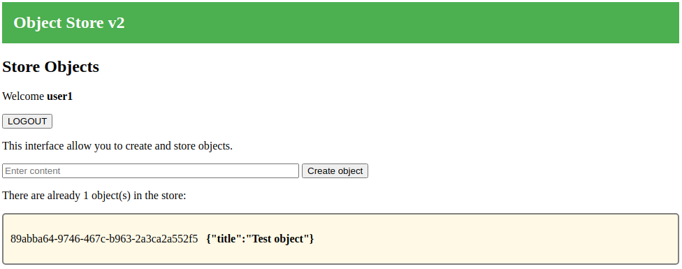
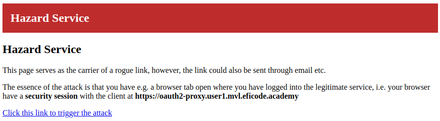

# Protecting against CSRF Attacks

## Learning Goals

- Protecting an application against the CSRF attack
- See the CSRF attack in-action to understand the nature of it

## Introduction

In this exercise we will deploy an object store protected by [OAuth2
proxy](https://github.com/oauth2-proxy/oauth2-proxy). However, even
though we apply a production-grade solution such as OAuth2-proxy, we
will demonstrate how easy it is to bypass and store objects in the
object store if we can trick the user to click an rogue link.

## Exercise

First, we deploy the object store. This creates a Kubernetes
deployment and a Kubernetes `ClusterIP` service, i.e. it is only
accessible inside the Kubernetes cluster:

```console
kubectl apply -f kubernetes/object-store-v2.yaml
```

Next, set some environment variables with your personal values:

```console
export USER_NUM=<X>             # Use your assigned user number
export TRAINING_NAME=<xxx>      # Get this from your trainer
export CLIENT1_ID=client1       # Change this if you didn't use this client name
export CLIENT1_SECRET=<xxx>     # This is your client1 'credential'
```

From the values above, define the following environment variable:

```console
export OIDC_ISSUER_URL=https://keycloak.user$USER_NUM.$TRAINING_NAME.eficode.academy/auth/realms/myrealm
```

Since OAuth2-proxy will interact with the identity-provider at
`OIDC_ISSUER_URL` to authenticate users, we will have to create a
secret with the client ID and secret. Also, OAuth2-proxy will manage a
session through signed cookies, i.e. it requires a secret for cookie
signatures. Thus, we create a secret for OAuth2-proxy with:

```console
kubectl create secret generic client1 \
    --from-literal=client-id=$CLIENT1_ID \
    --from-literal=client-secret=$CLIENT1_SECRET \
    --from-literal=cookie-secret=xyz12345678abcde
```

Externally we make OAuth2 proxy available at our externally available
`client1` DNS and we want the 'upstream' (the service behind OAuth2
proxy) to be the Kubernetes-internal DNS name `object-store`. I.e. setup
the to URLs as environment variables:

```console
export OAUTH2_PROXY_EP=https://client1.user$USER_NUM.$TRAINING_NAME.eficode.academy
export OAUTH2_PROXY_UPSTREAM=http://object-store-v2:80
```

Next we configure OAuth2-proxy Helm chart values with URLs from the
environment variables above:

```console
cat kubernetes/oauth2-proxy-values.yaml | envsubst > my-values.yaml
cat my-values.yaml
```

Inspect the generated Helm chart values.

Knowing that OAuth2-proxy implements the OIDC authorization code flow,
the `oidc_issuer_url` and `redirect_url` parameters should look
familiar.

The `upstreams` parameter is the service behind the proxy, i.e. this is
our object store Kubernetes service.

Finally, the `email_domains` parameter is the authorization policy
that OAuth2-proxy applies, i.e. any user with a verified email from
the given domain are authorized to access the protected service.

Next, install OAuth2-proxy with Helm:

```console
helm repo add oauth2-proxy https://oauth2-proxy.github.io/manifests
helm install client1 oauth2-proxy/oauth2-proxy --values my-values.yaml
```

When the OAuth2-proxy and object store PODs are `Running`, access the
URL we stored in the `OAUTH2_PROXY_EP` environment variable
above. First you will see the OAuth2-login page, which looks like
this:

> 

Click `Sign in with...` and you are redirected to KeyCloak. Sign in as
one of your users at KeyCloak and you can access the protected object
store:

> If you experience, that you are automatically signed in as a different user its probably due to an existing login session from a previous exercise. Go to the KeyCloak admin interface and delete the specific user session.

> 

The object store show existing objects in the store and the input
allow you to create additional objects.

#### Setting Up the Hazard

In the following we set up a service that implements the CSRF
attack. We are deploying the service on Kubernetes alongside the
Object Store, however, this proximity is purely for practical reasons
and is not needed for the attack. The hazard could equally well run
anywhere else.

Create the following environment variables, the first is the target
URL of the attack, i.e. our object store. The second URL is where we
can access the link that trigger the CSRF attack.

```console
export LEGIT_CLIENT_URL=$OAUTH2_PROXY_EP
export HAZARD_URL=https://hazard.user$USER_NUM.$TRAINING_NAME.eficode.academy
```

Finally, deploy the hazard service:

```console
cat kubernetes/hazard-service.yaml | envsubst > hazard.yaml
kubectl apply -f hazard.yaml
```

Open a second browser tab, keep one with ordinary client at the URL
stored in `OAUTH2_PROXY_EP` and another with the hazard service at the
URL stored in `HAZARD_URL`. The hazard service looks like this:

> 

Click the link on the hazard service and notice that nothing indicates
that you just created a new object in the object store. Go to the
other tab with the object store and refresh the page to see the 'Rouge
content' created by the CSRF.

#### Signing Out Protects Against CSRF

Next, sign out from the object store by clicking the `LOGOUT`
button. This deletes the security association between the browser and
the object store, i.e. the hazard service cannot piggyback on this to
execute the attack.

After this revisit the link in the hazard service - you should see no
difference in the response of the hazard service.

Finally, login to the object store again. You should now see, that no
new objects have been created.

#### Protecting the Object Store Against CSRF

In the following we will protect the object store against CSRF using a
pattern known as 'double submit cookie pattern'.

Before updating the client code, run the following command in a
separate console to see API log output:

```console
kubectl logs -f -l app=object-store-v2
```

<details>
<summary>I don't want to change any source code !</summary>
Fear not. The changes described below are available with the katas. Below, when asked to deploy the changed code, use the following commands instead to deploy code that already have implemented the described protection:

```
kubectl cp object-store-v2/src-with-csrf-protection/views/index.ejs `kubectl get pods -l app=object-store-v2 -o=jsonpath='{.items[0].metadata.name}'`:/app/oidc-oauth2-katas/object-store-v2/src/views/
kubectl cp object-store-v2/src-with-csrf-protection/client.js `kubectl get pods -l app=object-store-v2 -o=jsonpath='{.items[0].metadata.name}'`:/app/oidc-oauth2-katas/object-store-v2/src/
```
</details>

The essence of the protection is to include some secret information in
the form, which we can use to validate, that the POST operation stems
from a valid form received from the protected object store. The hazard
service cannot guess or fake this information.

Open the source for the object store front page
`object-store-v2/src/views/index.ejs` and add a hidden `csrf-nonce` input as
shown in the first line of the following form excerpt. This input will accompany
all valid `POST` requests made FROM this page. Since access to the page is
protected by OAuth2-proxy, only legitimate users can issue POST requests with a
valid nonce.

```
    <form action="/object" method="post">
      <input type="hidden" name="csrf-nonce" value="<%=csrf%>">
      <input type="text" placeholder="Enter content" name="content" size="50" required>
      <button type="submit">Create object</button>
    </form>
```

Next, we extent the object store to handle random nonces. Open the object store
Javascript `object-store-v2/src/client.js` and in the following we will add:

1. Creation of a random per-requests nonce `csrf_nonce`
2. Pass the `csrf_nonce` value to the rendering of the form above
3. Set a cookie with the same `csrf_nonce` value. This is used to validate the nonce received from POST requests. Using a cookie makes the object store stateless.

First, we extend the front-page GET with creation of a random nonce using `uuid`
and pass the `csrf_nonce` variable to the `render` method. This will result in
the nonce being part of the front-page received by legitimate clients. Second,
we set the nonce as an HTTPS-only cookie.

```node
app.get('/', (req, res) => {
    console.log('Headers in request:', req.headers)
    const username = req.headers['x-forwarded-preferred-username']

    // Create a random nonce, that can be used to validate, proves the
    // source of the POST request received the form from a valid
    // client.  Real nonce's should be unguessable, i.e. be
    // dynamically created.
    const csrf_nonce = uuid.v4();

    res.cookie('object-store-csrf', csrf_nonce, {secure: true, httpOnly: true, signed:true})
       .render('index', {client_title,
			 client_stylefile,
			 username,
			 csrf: csrf_nonce,    // Pass nonce to front-page
			 objects});
});
```

Finally, on POST requests we validate, that the form includes a nonce that
matches the value stored in the cookie. POSTs that do not contain a valid nonce
are rejected.

```node
app.post('/object', (req, res) => {
    csrf_nonce = req.body['csrf-nonce'];
    csrf_cookie = req.signedCookies['object-store-csrf'];
    if (!csrf_nonce || !csrf_cookie) {
	console.warn('Missing CSRF nonce, nonce', csrf_nonce, 'cookie', csrf_cookie);
    } else if (csrf_nonce != csrf_cookie) {
	console.warn('CSRF nonce mismatch, nonce', csrf_nonce, 'cookie', csrf_cookie);
    } else {
	const id = uuid.v4();
	objects[id] = req.body.content;
	console.log("Created object ", id, ", content '"+objects[id]+"'");
    }
    res.redirect('/');
});
```

<details>
<summary>Can the nonce be faked?</summary>
Yes, if non-signed cookies are used. The implementation used here signs cookies to protect against a illegitimate client POSTing with a faked nonce and cookie
</details>

To deploy the changes, use `kubectl cp` to copy the code changes to the running
object store POD:

```console
kubectl cp object-store-v2/src/views/index.ejs `kubectl get pods -l app=object-store-v2 -o=jsonpath='{.items[0].metadata.name}'`:/app/oidc-oauth2-katas/object-store-v2/src/views/
kubectl cp object-store-v2/src/client.js `kubectl get pods -l app=object-store-v2 -o=jsonpath='{.items[0].metadata.name}'`:/app/oidc-oauth2-katas/object-store-v2/src/
```

After this, you will see from the POD log output, that the object store service
is restarted.

Finally, try to execute the attack as previously and simultaneously observe logs
from the object store POD. You should see from the POD log, that when you
attempt the attack, the POST request is rejected due to a 'missing csrf nonce'.

### Clean up

```console
helm delete client1
kubectl delete secret client1
kubectl delete -f kubernetes/object-store-v2.yaml
kubectl delete -f hazard.yaml
```
