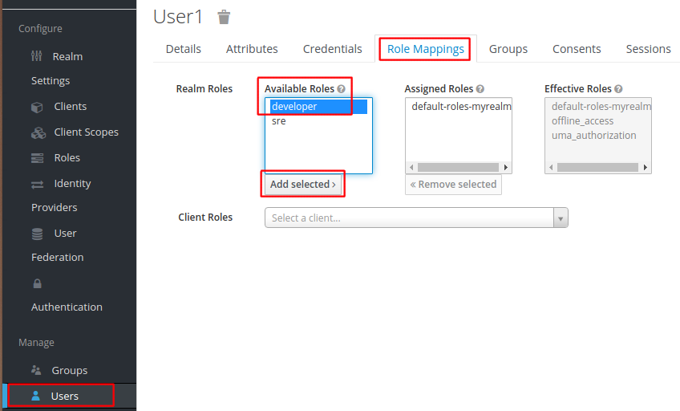

# Adding Roles to KeyCloak Users

This guide extends the setup from [Setting up
KeyCloak](setting-up-keycloak.md) with roles for users.

# Create Role

Login into KeyCloak and select `Roles` in the left-hand menu and then `Add Role` in the top menu:

> 

Create two roles, e.g. `developer` and `sre`.

# Adding Role to User

Select `Users` in the left-hand menu, click `View all users` and
select the user you created in [Setting up
KeyCloak](setting-up-keycloak.md).

In the user settings, select `Role Mappings` in the top menu. Next,
chose one of the roles you created above in the `Available Roles` list
and click `Add selected`. The role should now be assigned to the user
and shown in the `Assigned Roles` list:

> 

Create a second user and assign the other role you created to that user.
