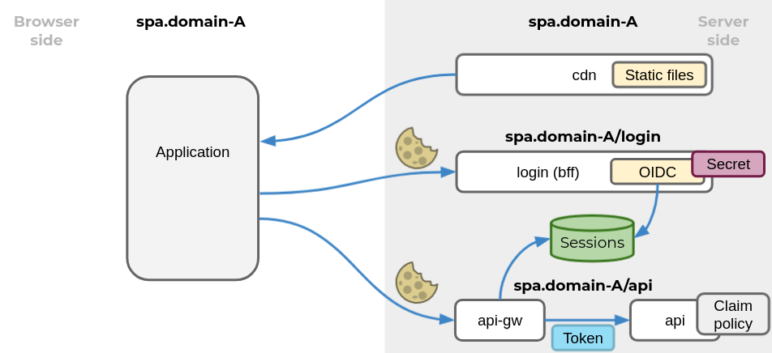
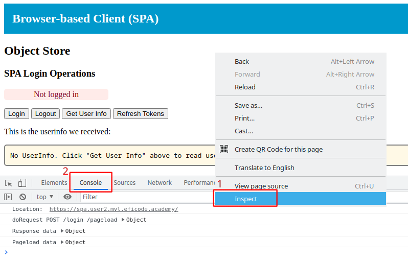

# OIDC in Browser-based Apps (SPAs)

This exercise will demonstrate how to implement OIDC in browser-based
applications, aka. single-page-applications (SPAs).  OIDC will be
implemented using authorization code flow with the
backend-for-frontend (BFF) pattern. This means, that for improved
security, the OIDC functionality is handled server-side in close
collaboration with the SPA.

The architecture is illustrated below. The API (white box in lower
right corner) the SPA accesses is the `object-store` we used in
exercise [Protecting Resources and APIs](protecting-apis.md)

> 

## Learning Goals

- OIDC in SPAs
- Backend-for-frontend pattern

## Prerequisites

This exercise use the following environment variables. **They will
already be configured for Eficode-run trainings**:

```
STUDENT_NUM
TRAINING_NAME
SPA_CLIENT_ID
SPA_CLIENT_SECRET
```

Use the following command to inspect your environment variables:

```console
env | egrep 'STUDENT_NUM|TRAINING_NAME|^CLIENT[12]_|^SPA_|^OIDC_' | sort
```

Exercises assume you have changed to the katas folder:

```console
cd oidc-oauth2-katas
```

## Exercise

In the following, we will deploy the four components that make-up the
SPA - the four white server-side boxes in the figure above - top to
bottom: 'CDN', 'Login BFF', 'API gateway BFF' and 'API'.

First, set some variables that help us build URLs:

```console
export DOMAIN=student$STUDENT_NUM.$TRAINING_NAME.eficode.academy
export OIDC_ISSUER_URL=https://keycloak.$DOMAIN/auth/realms/myrealm
export SPA_BASE_URL=https://spa.$DOMAIN
echo $SPA_BASE_URL
```

### Deploy SPA CDN

First we deploy a simple server that merely servers the static files
of the SPA. We call this `spa-cdn`. This server will send a
[Content-Security-Policy](https://developer.mozilla.org/en-US/docs/Web/HTTP/Headers/Content-Security-Policy)
(CSP) HTTP header for added security. We configure the CSP policy such
that the SPA is only allowed make connections to its own base
URL. This provides strong protection against cross-site scripting
attacks.

Configure and deploy `spa-cdn` with:

```console
kubectl create configmap spa-cdn \
    --from-literal=csp_connect_sources="$SPA_BASE_URL"
kubectl apply -f kubernetes/spa-cdn.yaml
```

You can now access the SPA at the URL you stored in the `SPA_BASE_URL`
environment variable above.:

Initially the SPA will look like shown below, but it will not be fully
functional since we are still missing some components.

> 

### Deploy Login BFF

Next we will deploy the login backend-for-frontend (BFF), which we
call `login`. Create a `Secret` and `ConfigMap` with OIDC
configuration information similar to what we have seen in other
exercises. Note that we use the SPA base URL as the redirection URL,
i.e. where we return after having completed login at the identity
provider:

```console
kubectl create secret generic spa-client \
    --from-literal=client_id=$SPA_CLIENT_ID \
    --from-literal=client_secret=$SPA_CLIENT_SECRET
kubectl create configmap spa-login \
    --from-literal=oidc_issuer_url=$OIDC_ISSUER_URL  \
    --from-literal=redirect_url=$SPA_BASE_URL
```

Finally, deploy the `login` component:

```console
kubectl apply -f kubernetes/spa-login.yaml
```

### Deploy API

We will use the 'object store' from exercise [Protecting Resources and
APIs](protecting-apis.md) as an example of a protected resource with
an API that use an access token to authorizing access. The
object-store allow any access token as long at it comes from a trusted
provider.

Create a `ConfigMap` with the OIDC issuer from which the object-store
will trust access tokens:

```console
kubectl create configmap api \
    --from-literal=oidc_issuer_url=$OIDC_ISSUER_URL
```

and deploy the API:

```console
kubectl apply -f kubernetes/protected-api.yaml
```

### Deploy API Gateway

The SPA cannot access the API yet, since it needs a component to
exchange the session cookie for an access token. The API gateway
component does that.

Deploy the API gateway with:

```console
kubectl apply -f kubernetes/spa-api-gw.yaml
```

All components of the SPA are now deployed.

## Login Through Backend-for-Frontend

To monitor an OIDC login with the SPA, monitor the BFF logs with the following command:

```console
kubectl logs -f --tail=-1 -l app=spa-login -c client
```

Also, go to the browser tab with the SPA and right-click and select
'Inspect' in the menu and second 'Console' to watch debug output from
the SPA:

> 

The four 'login-related' buttons are bound to BFF operations as follows:

- `Login` - BFF path `/login/start` - the BFF will return a URL which the SPA should redirect to for OIDC login
- `Logout` - BFF path `/login/logout` - the BFF will return a URL which the SPA should redirect to for OIDC logout
- `Get User Info` - BFF path `/login/userinfo` - the BFF will return ID token claims
- `Refresh Tokens` - BFF path `/login/refresh` - the BFF will initiate token refresh from the OIDC provider

Finally, the SPA will *on all pageloads* call the BFF path
`/login/pageload`. This is necessary to forward the authorization code
flow `code` back to the BFF such that it can complete an authorization
code flow login. Obviously, the SPA could be optimized to only call
this on URLs that potentially completes an authorization code flow.

Inspect the SPA Javascript
[app.js](spa/spa-app-vanilla-js/dist/js/app.js) and observe e.g. how
the `doLogin` button is bound to the `doBFFLogin` Javascript function
(at the end of the source file) on page load and also how the SPA
calls `doBFFPageLoad()` with the full page URL:

```nodejs
window.addEventListener('load', () => {
    ...
    $('#doLogin').click(doBFFLogin);
    ...
    doBFFPageLoad(location.href);
});
```

When clicking the `Login` button, the SPA calls the `doBFFLogin()`
function and makes a request to the BFF. The BFF return a JSON
structure with an `authRedirUrl` field with where the SPA should
redirect for the OIDC login.

The BFF is basically just an remote-procedure-call OIDC library.
Spend a few minutes looking through the interface to the BFF in the
[BFF README](spa/bff/README.md).

The SPA use a network function `doBFFRequest()` to perform the HTTP
`POST` operation:

```nodejs
const doBFFLogin = async () => {
    data = await doBFFRequest('POST', '/start', null);
    location.href = data['authRedirUrl']
}
```

This is very similar to an ordinary server-side OIDC application, with
the exception, that the server side application would return an HTTP
303 redirect message instead of relying on a browser side application
doing the redirect.

## Login

Click the `Login` button.

In the logs from the Login BFF, you will see, that it returns a
redirect URL very similar to what we have seen before:

```
Return authRedirUrl: https://keycloak.user ... client_id=spa&scope=openid%20profile&response_type=code ...
```

The SPA browser window will redirect to KeyCloak for user login, and
when login is completed return back to the redirection URL specified
in the `authRedirUrl`.

When the SPA has reloaded after login, the SPA console output will
show, that the SPA calls-back to the Login BFF with the authorization
code flow `code` (you may have to unfold the console log message to
see the full details):

```
doRequest POST /login/pageload  {pageUrl: "https://spa.user2.oidc.eficode.academy/?state=xxxxx&session_state=yyyyy&code=xxxxx"}
```

And you will see, that the BFF responds with information about our
logged-in state:

```
Pageload data {loggedIn: true, handledAuth: true}
```

## Get UserInfo from BFF

Next, click the `Get User Info` button to get the ID token claims. One
of two things will now happen:

1. You receive userinfo data and the SPA will show the details. You
may recognize this as ID token claims.

2. Your access token has expired (the SPA client is configured with an
access token lifespan of 1 minute). The UserInfo area will show
`**ERROR** (tokens expired?)`. Use the `Refresh Tokens` button to
initiate token refresh through the BFF and click `Get User Info` again.

If your tokens where not expired, its worth spending a minute to let
them expire and try the `Get User Info` and `Refresh Tokens`
procedure. *A full-fledged SPA would obviously need to detect this
situation and automatically refresh tokens without user interactions.*

## Accessing the Protected API

The SPA has two buttons for interacting with the protected object store:

- `Create Object` - does a `POST` towards the `/api/object` path. The
  `api-gw` rewrites this path and strips `/api`, hence we end up with
  a `POST` towards the object-store `/object` path, which stores the object and
  returns the object ID. See also the [object-store
  implementation](object-store/src/index.js).

- `List Objects` - does a `GET` towards the `/api/objects` path to
  fetch all object IDs. The `api-gw` rewrites this path and strips
  `/api`, hence we end up with a `GET` towards the object-store
  `/objects` path.

To watch the authorization successes and failures, run the following
command to show API logs:

```console
kubectl logs -f --tail=-1 -l app=api
```

Watch particularly for the HTTP status codes, e.g. the following show a success (HTTP code 200). Failures should similarly show a [HTTP code 401](https://developer.mozilla.org/en-US/docs/Web/HTTP/Status/401).

```
GET /objects HTTP/1.1" 200 ...
```

Note also, that since the object store/API validates the access token provided and since the access token lifespan is configured to 1 minute, errors related to access token expiry may be experienced and observed in the object store/API logs:

```
...  TokenExpiredError: jwt expired
...  POST /object HTTP/1.1" 401 ...
```

Use the `Refresh Tokens` button to refresh the access token. A
full-fledged SPA would obviously need to detect this situation and
automatically refresh tokens without user interactions.

Experiment with listing and creating objects in both logged-in,
logged-out and tokens-expired situations.

### Clean up

```console
kubectl delete -f kubernetes/spa-cdn.yaml
kubectl delete -f kubernetes/spa-login.yaml
kubectl delete -f kubernetes/spa-api-gw.yaml
kubectl delete -f kubernetes/protected-api.yaml
kubectl delete cm spa-cdn spa-login api
kubectl delete secret spa-client
```
