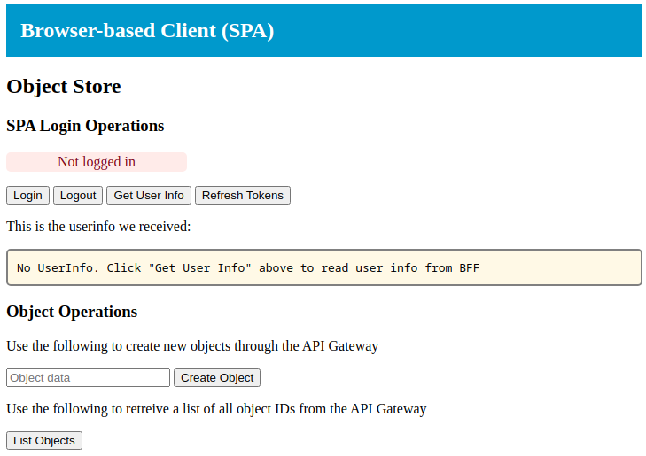

# OIDC in Browser-based Apps (SPAs)

This exercise will demonstrate how to implement OIDC in browser-based
applications, aka. single-page-applications (SPAs).  OIDC will be
implemented using authorization code flow with the
backend-for-frontend (BFF) pattern. This means, that for improved
security, the OIDc functionality is handled server-side in close
collaboration with the SPA.

## Learning Goals

- OIDC in SPAs
- Backend-for-frontend pattern

## Exercise

```console
export DOMAIN=user$USER_NUM.$TRAINING_NAME.eficode.academy
export SPA_BASE_URL=https://spa.$DOMAIN
```

### Deploy SPA

TODO prepare config.json

```console
kubectl create configmap spa-cdn \
    --from-literal=csp_connect_sources="$SPA_BASE_URL"
```

```console
kubectl apply -f kubernetes/spa-cdn.yaml
```

This deploys a content-delivery POD to Kubernetes and you can now
access the SPA at the URL you stored in the `DOMAIN` environment
variable above.:

Initially the SPA will look like shown below, but it will not be fully
functional since we are still missing some components.

TODO update screen shot

> 

### Deploy BFF

Next we will deploy the BFF, which we call `login`. First create
environment variables for our identity provider:

```console
export CLIENT1_ID=client1
export CLIENT1_SECRET=<xxx>     # This is your client1 'credential'
export OIDC_ISSUER_URL=https://keycloak.$DOMAIN/auth/realms/myrealm
```

and create a secret and configmap with this information. Note that we
use the SPA base URL as the redirection URL, i.e. where we return
after having completed login at the identity provider:

```console
kubectl create secret generic client1 \
    --from-literal=client_id=$CLIENT1_ID \
    --from-literal=client_secret=$CLIENT1_SECRET
kubectl create configmap spa-login \
    --from-literal=oidc_issuer_url=$OIDC_ISSUER_URL  \
    --from-literal=redirect_url=$SPA_BASE_URL
```

Finally, deploy the `login` component:

```console
kubectl apply -f kubernetes/spa-login.yaml
```

With the `login` component deployed, we are almost able to perform a
login - what are we missing (hint, its related to the authorization
code flow between BFF and identity provider)?

<details>
<summary>:bulb:Hint</summary>
With the initial login request from BFF to identity provider, a number of parameters are passed, e.g. scope, client-ID and redirection URL for where to go after the login. Are all these parameters correct now?
<details>
<summary>:bulb:Answer</summary>
We have used the `client1` settings configured for previous exercises, e.g. the redirection URL configured in the identity provider does not match the SPA and is probably configured to something starting with `client1` right now. You need to go to the KeyCloak admin interface and update this URL to match the SPA.
</details>
</details>


### Deploy API

We will use the 'object store' from exercise [Protecting Resources and
APIs](protecting-apis.md) as an example of a protected resource with
an API that use OIDC/OAuth2 for authorizing access.

Create a Kubernetes `ConfigMap` for API OIDC issuer configuration:

```console
kubectl create configmap api \
    --from-literal=oidc_issuer_url=$OIDC_ISSUER_URL
```

and deploy the API:

```console
kubectl apply -f kubernetes/protected-api.yaml
```

### Deploy API Gateway

The SPA cannot access the API yet, since it needs a component to
exchange the cookie for an access token. The API gateway component
does that.


```console
kubectl apply -f kubernetes/spa-api-gw.yaml
```


### Clean up

```console
kubectl delete -f kubernetes/spa-cdn.yaml
kubectl delete -f kubernetes/spa-login.yaml
kubectl delete cm spa-cdn spa-login
kubectl delete secret client1
```
