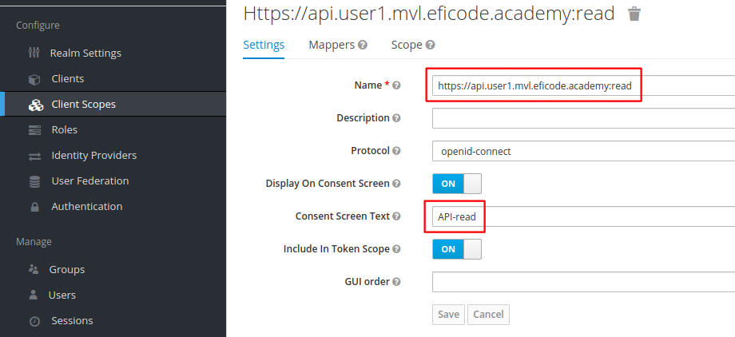
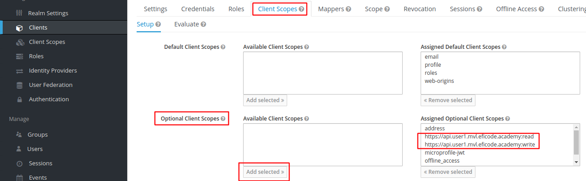

# Protecting APIs

## Learning Goals

- Protecting a REST API with access tokens
- Fine-grained access control with token scopes
- Adding custom scopes in KeyCloak

## Introduction

In this exercise we will deploy a REST API that allow us to read and
write objects to an object store. When creating an object an ID is
assigned to the object, and the object can later be retrieved using
the ID. We can also read a list of IDs for all objects.

We will protect access to the API with access tokens obtained through
our client and perform operations against the API using the `curl` and
the CLI, however, these operations could easily be coded into the
client itself.

We will also protect different methods of the API using different
access token scopes.

## Exercise

First, set some variables that help us build URLs:

```console
export USER_NUM=<X>             # Use your assigned user number
export TRAINING_NAME=<xxx>      # Get this from your trainer
```

For convenience, set the following variables:

```console
export CLIENT1_ID=client1
export CLIENT1_SECRET=<xxx>     # This is your client1 'credential'
export CLIENT1_BASE_URL=https://client1.user$USER_NUM.$TRAINING_NAME.eficode.academy
export OIDC_ISSUER_URL=https://keycloak.user$USER_NUM.$TRAINING_NAME.eficode.academy/auth/realms/myrealm
```

### Deploy Client

Create a Kubernetes `ConfigMap` and `Secret` for client configuration:

```console
kubectl create secret generic client1 \
    --from-literal=client_id=$CLIENT1_ID \
    --from-literal=client_secret=$CLIENT1_SECRET
kubectl create configmap client1 \
    --from-literal=oidc_issuer_url=$OIDC_ISSUER_URL  \
    --from-literal=client_base_url=$CLIENT1_BASE_URL
```

and deploy the client:

```console
cd oidc-oauth2-katas/
kubectl apply -f kubernetes/client1-v2.yaml
```

### Deploy API

Create a Kubernetes `ConfigMap` for API configuration:

```console
kubectl create configmap api \
    --from-literal=oidc_issuer_url=$OIDC_ISSUER_URL
```

and deploy the API:

```console
cd oidc-oauth2-katas/                # Skip this if you did it above
kubectl apply -f kubernetes/protected-api.yaml
```

### Accessing the API

When the client POD is `Running`, do a login to get tokens and export
the access token in the CLI:

```console
export ACCESS_TOKEN=<yyy>
```

For convenience, set an variable that holds the API endpoint

```console
export API_EP=https://api.user$USER_NUM.$TRAINING_NAME.eficode.academy
```

Now we can access the API using the access token in an `Authorization`
header. To get a list of object IDs through the API use:

```console
curl -H "Authorization: Bearer $ACCESS_TOKEN" $API_EP/objects && echo ""
```

To read a specific object ID, use:

```console
export OBJID=`curl -s -H "Authorization: Bearer $ACCESS_TOKEN" $API_EP/objects | jq -r .[0]`
curl -H "Authorization: Bearer $ACCESS_TOKEN" $API_EP/object/$OBJID && echo ""
```

Initially the API/object store only holds a single object. To write
new objects use a `POST` operation:

```console
curl -X POST -H "Authorization: Bearer $ACCESS_TOKEN" --data '{"title":"Test object 2"}' -H "Content-Type: application/json" $API_EP/object
curl -X POST -H "Authorization: Bearer $ACCESS_TOKEN" --data '{"title":"Test object 3"}' -H "Content-Type: application/json" $API_EP/object
curl -H "Authorization: Bearer $ACCESS_TOKEN" $API_EP/objects && echo ""
```

Try leaving out the token or the `Authorization` header. This
illustrate we can access the API **as long as we provide an access token**.

### Using Scope to Gate Access to API

In this section we will improve access to the API through fine-grained
authorization such that we can control which tokens allow read and
write.

We will gate access based on the `scope` claim in the access token. To
see the `scope` of your current access token use this command:

```console
echo $ACCESS_TOKEN | cut -d. -f2 |base64 -d | jq .
```

First we need to add two new scopes, one for read and one for write.

#### Adding New Scopes with KeyCloak

Go to the KeyCloak admin UI and select `Client Scopes` in the
left-hand menu and `Create` in the right-hand corner. Next, add a
scope that use your API endpoint URL as name **prefixed with `:read`**
and `Consent Screen Text` set to `API-read` similar to the following:

> 

Also create a scope that ends with `:write` and name `API-write`.

Finally we need to add the new scopes as optional scopes for our
client. Select `Client` in the left-hand menu and `Client Scopes` in
the top-menu. This setting allow us to specify which scopes are
returned by default and which are optional and thus can be requested
by clients.

In the `Optional Client Scopes` list, select one of our new scopes and
click `Add selected` to allow this client to use the scope. Do this
for both scopes:

> 

Next, go to the client, logout and before logging-in again, specify an additional scope after `openid profile`, e.g.

```
openid profile https://api.user1.mvl.eficode.academy:read
```

After login, you should see the new scope in the access token with:

```console
export ACCESS_TOKEN=<xxx>
echo $ACCESS_TOKEN | cut -d. -f2 |base64 -d | jq .
```

#### Adding Scope to the API

The API is implemented as a Node/Express application and the source is
found in [object-store/src/index.js](object-store/src/index.js).

Open `index.js` in an editor on the machine where you are running your
`kubectl` commands. Locate the `GET` for object-by-id. It looks like
this:

```
	app.get('/object/:id',
		//allowScopes(['yyy']),
		(req, res) => {
		    const id = req.params.id;
		    res.send(objects[id]);
		});
```

The get-by-id method is gated by a (commented out) `allowScopes`
function that are also in the `index.js` file. This function ensures
that one or more scopes are present in the access token and generates
and error if not.

Before updating the API authorization code, run the following command
in a separate console to see API log output:

```console
kubectl logs -f -l app=api
```

Next, edit `object-store/src/index.js` and remove the `//` in front of
`allowScopes` **but keep the `yyy` scope**. Since this is a scope we
do not have in out access token we should expect and error when trying
to access the API.

Next, use `kubectl cp` to copy the code changes to the running API
POD:

```console
kubectl cp object-store/src/index.js `kubectl get pods -l app=api -o=jsonpath='{.items[0].metadata.name}'`:/app/oidc-oauth2-katas/object-store/src/
```

After this, you will see from the log output, that the API service is restarted.

Try fetching an object from the API similarly to what we did initially:

```console
export OBJID=`curl -s -H "Authorization: Bearer $ACCESS_TOKEN" $API_EP/objects | jq -r .[0]`
curl -H "Authorization: Bearer $ACCESS_TOKEN" $API_EP/object/$OBJID && echo ""
```

You should see the access being denied with:

```
{"message":"insufficient_scope","status":403}
```

Next, update `object-store/src/index.js` to require the new `:read`
scope we added, e.g. similarly to what is shown below and use `kubectl
cp` to update the API POD.

```
	app.get('/object/:id',
		allowScopes(['https://api.user1.mvl.eficode.academy:read']),
		(req, res) => {
		    const id = req.params.id;
		    res.send(objects[id]);
		});
```

Retry the get-by-id operation, which should now succeed.

Optionally, add the `:write` scope to the object-store `POST` method in the API.

### Clean up

```console
kubectl delete -f kubernetes/protected-api.yaml
kubectl delete cm api
kubectl apply -f kubernetes/client1-v2.yaml
kubectl delete cm client1
kubectl delete secret client1
```
