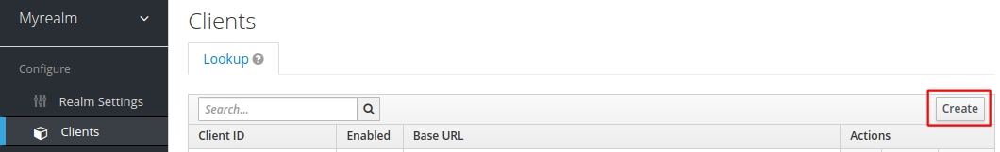

# Setting up KeyCloak

This guide describes how to configure KeyCloak as OIDC provider for
the exercises in this repo. This guide does not cover how to deploy
KeyCloak.

You must have an URL for KeyCloak before using this guide. If you are
participating in an Eficode training, the URL will look like the
following:

```
https://keycloak.student<X>.<training-name>.eficode.academy
```

where `<X>` is your assigned user number and `<training-name>` is a
per-training specific name that your trainer will inform you about.

**Note, for Eficode-run trainings KeyCloak is preconfigured and you do not need to configure KeyCloak**

## Overview

Generally, this guide will configure the following in Keycloak:

- A realm named `myrealm`.
- Two roles named `developer` and `sre`.
- A user named `user1` with the `developer` role.
- A user named `user2` with the `sre` role.
- A confidential client named `client1` with root URL `https://client1.student<X>.<training-name>.eficode.academy`.
- A confidential client named `client2` with root URL `https://client2.student<X>.<training-name>.eficode.academy`.
- A confidential client named `spa` with root URL `https://spa.student<X>.<training-name>.eficode.academy`.

## Step-by-Step Instruction

First, log into KeyCloak as administrator. This typically means use
the `admin` username and the password obtained from the following
command:

```console
kubectl get secret keycloak -o jsonpath='{.data.admin-password}' | base64 -d && echo
```

### Create Realm

When logged in, move you mouse to the upper left corner and select
`Add realm` as shown below:

> 

Enter the realm name `myrealm` and click `Create`.

Click `Save` to save realm settings at the end of the page.

### Create Roles

Select `Roles` in the left-hand menu and then `Add Role` in the top menu:

> 

Create two roles, e.g. `developer` and `sre`.

### Adding Users

Use the following procedure to configure a user.

Select `Users` in the left-hand menu and then `Add user` in the right-hand side:

> 

Enter username, email, first and last name. Also, check the `Email Verified` toggle:

> Note the example user email domain `example.com` - please do the same as we will use this later for verification.

> 

When done configuring the user, click `Save`.

Finally, set the user password. Select `Credentials` in the top menu,
enter a password and ensure that `Temporary` is set to `OFF`:

> 

#### Adding Role to User

In the user settings, select `Role Mappings` in the top menu. Next,
chose one of the roles you created above in the `Available Roles` list
and click `Add selected`. The role should now be assigned to the user
and shown in the `Assigned Roles` list:

> 

**Repeat the steps above to create a second user**

### Configuring Clients

To allow clients to login users and obtain tokens from Keycloak, they
must be configured first.

Select `Clients` in the left-hand menu and click `Create`:

> 

Next, give the client an ID, e.g. `client1` and add a root URL of
the application. Click `Save` when you have added client settings.

> We will be using the names `client1`, `client2` and `spa` in the exercises in this repository. If you choose other names you will have to adjust the exercises accordingly.

For an Eficode training your client URL will look like the following
(where you need to place `<X>` and `<training-name>` as above):

```
https://client1.student<X>.<training-name>.eficode.academy
```

> 

After having created a client, we are presented with further details
about the client. Scroll down and locate `Consent Required` and change
it to `On`. Also locate `Access Type` and change it to `confidential`
as shown below.

> 

Finally, open the `Advanced Setting` menu almost at the end of the
page and change the `Access Token Lifespan` to 60 minutes as shown
below (**note, use 1 minute for the `spa` client**):

> 

Click `Save` at the end of the page.

After having changed the client access type to `confidential`, we get
a `Credentials` tab in the top menu. Select the `Credentials` tab.

On the credentials page we see, that `Client Authenticator` is set to
`Client Id and Secret` and we also see the secret which has been
assigned to the client. We will need this secret later, i.e. now you
know where to locate it.

> 

**Repeat the steps above to create `client2` and `spa` client. For the
  `spa` client, configure the Access Token Lifespan to 1 minute!**
