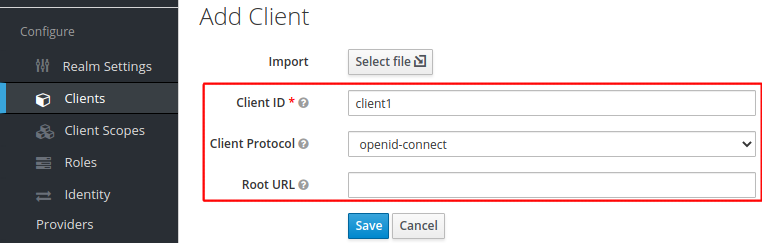
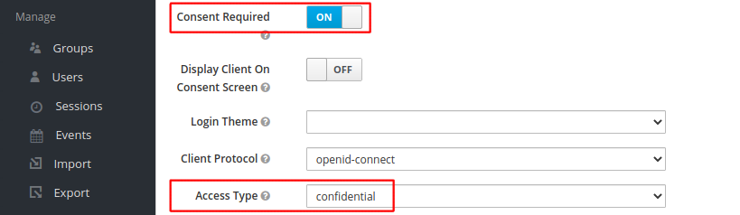

# Setting up KeyCloak

This guide describes how to create a realm in KeyCloak, add a user and
a client configuration. This guide does not cover how to deploy
KeyCloak. You must have an URL for KeyCloak before using this
guide. If you are participating in an Eficode training, the URL will
look like the following:

```
https://keycloak.user<X>.<training-name>.eficode.academy
```

where `<X>` is your assigned user number and `<training-name>` is a
per-training specific name that your trainer will inform you about.

First, log into KeyCloak as administrator. This typically means use
the `admin` username and the password obtained from the following
command:

```console
kubectl get secret keycloak -o jsonpath='{.data.admin-password}' | base64 -d && echo
```

When logged in, move you mouse to the upper left corner and select
`Add realm` as shown below:

> 

Enter the realm name `myrealm` and click `Create`.

Next, select `Realm Settings` in the left-hand menu and `Tokens` in
the top-menu. Locate `Access Token Lifespan` and change it from 5
minutes to 30 minutes.

Click `Save` to save realm settings at the end of the page.

## Adding Users

Use the following procedure to configure a test user.

Select `Users` in the left-hand menu and then `Add user` in the right-hand side:

> 

Enter username, email, first and last name. Also, check the `Email Verified` toggle:

> Note the example user email domain `example.com` - please do the same as we will use this later for verification.

> 

When done configuring the user, click `Save`.

Finally, set the user password. Select `Credentials` in the top menu,
enter a password and ensure that `Temporary` is set to `OFF`:

> 

**Repeat the steps above to create a second user**

## Configuring Clients

To allow clients to login users and obtain tokens from Keycloak, they
must be configured first.

Select `Clients` in the left-hand menu and click `Create`:

> 

Next, give the client an ID, e.g. `client1` and add a root URL of
the application. Click `Save` when you have added client settings.

> We will be using the names `client1` and `client2` in the exercises in this repository. If you choose other names you will have to adjust the exercises accordingly.

<details>
<summary>:question:Which client URL should I use?</summary>

The client root URL depends on where you run the client application
and how you access it from your browser. If you use your laptop
browser and also run the client application on your laptop, the root
URL might be something like `http://localhost:5000`. For an Eficode
training, you will be running the clients on Kubernetes and your
client URL will look like the following (where you need to place `<X>`
and `<training-name>` as above):

```
https://client1.user<X>.<training-name>.eficode.academy
```

</details>

> 

After having created a client, we are presented with further details
about the client. Scroll down and locate `Consent Required` and change
it to `On`. Also locate `Access Type` and change it to `confidential`
as shown below.

> 

Finally, open the `Advanced Setting` menu almost at the end of the
page and change the `Access Token Lifespan` to 60 minutes as shown
below:

> 

Click `Save` at the end of the page.

After having changed the client access type to `confidential`, we get
a `Credentials` tab in the top menu. Select the `Credentials` tab.

On the credentials page we see, that 'Client Authenticator' is set to
`Client Id and Secret` and we also see the secret which has been
assigned to the client. We will need this secret later, i.e. now you
know where to locate it.

> 

**Repeat the steps above to create a 'client2'**
