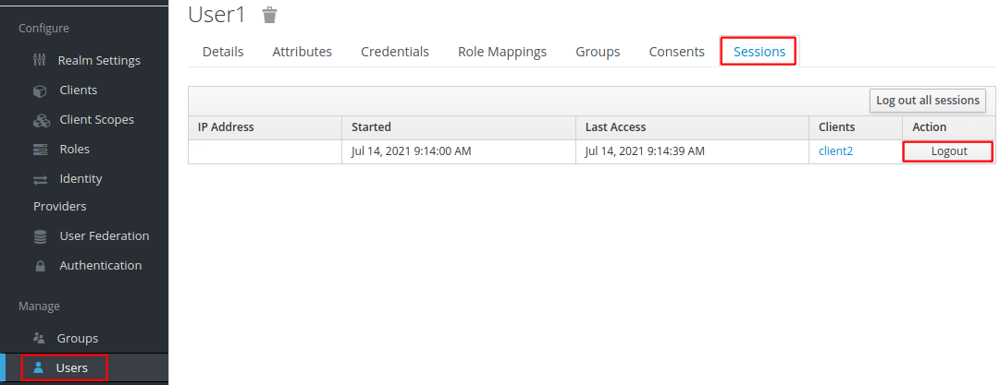

# Template headline

## Learning Goals

- See how we validate and use tokens
- Understand the concept of token 'audience'
- Refresh of tokens

## Introduction

...

## Exercise

### Overview

- In bullets, what are you going to solve as a student

### Using Tokens with Curl

```console
export ID_TOKEN=<xxx>
export ACCESS_TOKEN=<yyy>
export REFRESH_TOKEN=<zzz>
```

```console
export USERINFO_EP=`curl -s https://keycloak.user$USER_NUM.$TRAINING_NAME.eficode.academy/auth/realms/myrealm/.well-known/openid-configuration | jq -r .userinfo_endpoint`
export INTROSPECTION_EP=`curl -s https://keycloak.user$USER_NUM.$TRAINING_NAME.eficode.academy/auth/realms/myrealm/.well-known/openid-configuration | jq -r .introspection_endpoint`
```

```console
curl -H "Authorization: Bearer $ACCESS_TOKEN" $USERINFO_EP | jq .
```

```
{
  "sub": "ae2e5feb-44dd-49cd-96cd-dd68deee7c0c",
  "email_verified": true,
  "name": "Aname1 Alastname1",
  "preferred_username": "user1",
  "given_name": "Aname1",
  "family_name": "Alastname1",
  "email": "user1@example.com"
}
```

In exercise [Confidential Client with Authorization Code
Flow](confidential-client-auth-code-flow.md) we displayed the 'logged
in as' username using the ID-token claim
`preferred_username`. Normally clients will use the `/userinfo`
endpoints to retrieve the above information and use that
instead. ID-tokens are only required to contain a few claims such as
`sub` (subject), which can be pretty anonymous.

```console
curl --data "client_id=$CLIENT_ID&client_secret=$CLIENT_SECRET&token=$ACCESS_TOKEN" $INTROSPECTION_EP | jq .
```

> If you get an error while using the access token, its most likely because the access token has expired. KeyCloak use a default timeout of 5 minutes. To solve this, use the client to logout and login again to get fresh tokens.

```
{
  "active": true,
  "scope": "openid profile email",
  ...
  "name": "Aname1 Alastname1",
  "given_name": "Aname1",
  "family_name": "Alastname1",
  "preferred_username": "user1",
  "email": "user1@example.com",
  "email_verified": true,
  "username": "user1",
}
```

```console
curl --data "client_id=$CLIENT_ID&client_secret=$CLIENT_SECRET&token=$REFRESH_TOKEN" $INTROSPECTION_EP | jq .
```

```
{
  "active": true
  "scope": "openid profile email",
  "exp": 1626236894,
  ...
  "sub": "ae2e5feb-44dd-49cd-96cd-dd68deee7c0c",
  "typ": "Refresh",
  "client_id": "client1",
  "username": null,
}

```

Of particular interest here is the `active` field, which indicate that
the token has not expired or been revoked.

The token introspection endpoint returns a [standardized
response](https://datatracker.ietf.org/doc/html/rfc7662#section-2.2)
however, only the `active` field is guaranteed in the response.

### Refreshing Tokens

With the refresh token, we can refresh our access token (and possibly
the ID-token and the refresh token as well). This is done through the
token endpoint. As from the previous exercise, store the identity
provider token endpoint in an environment variable:

```console
export OIDC_TOKEN_URL=`curl -s https://keycloak.user$USER_NUM.$TRAINING_NAME.eficode.academy/auth/realms/myrealm/.well-known/openid-configuration | jq -r .token_endpoint`
```

Next, issue a refresh request using `grant_type=refresh_token` and specifying the current refresh token:

```console
curl --data "client_id=$CLIENT_ID&client_secret=$CLIENT_SECRET&grant_type=refresh_token&refresh_token=$REFRESH_TOKEN" $OIDC_TOKEN_URL | jq .
```

This request return at least a new access token. It may also return a
new ID-token and refresh token, but this is not required by the OIDC
standard. If new ID/refresh tokens are returned, they should be used
going forward, and the old ones discarded.

A new ID token does not signify that the user still has a login
session through the browser. The client can continue to refresh tokens
even after the user has closed the browser and similarly continue to
access whatever the access token protects. This is an example of
**access being delegated from the user to the client**.

### Re-validating User Login

The user login authentication session exists between the user/browser
and the identity provider. The client does not know the status of this
session. The only way for a server-side client to validate if the user
still has a valid session is to re-authenticate, e.g. re-do the
authorization code flow login.

> With in-browser Javascript we can do more, but that is not within the scope of this exercise.

To see current user login sessions from a KeyCloak perspective, go to
KeyCloak and in the left-hand menu select `Users` and then `View all
users` in the top menu. Next, click on the user ID of the user
logged-in and then `Sessions` in the top menu. Next, you will see the
following.

> 

The client have a button `Check Login Status`, which re-authenticates using the authorization code flow with two extra parameters:

- `prompt=none`, i.e. do not prompt the user for login, we prefer an error if user is no longer logged-in.
- `id_token_hint=xxx`, this is the user for which we want to silently log-in.

To see this in action, watch the client logs with the command below and press the `Check Login Status` button.

```console
kubectl logs -f -l app=client1
```

In the logs you should see the following (slightly edited for brevity)

```
Redirecting login to identity provider https://keycloak.userX..../openid-connect/auth?response_type=code&...&id_token_hint=XXXX&prompt=none
```

You will also see that as long as the user have a login session with
KeyCloak, the silent authorization successfully issues a new
ID-token. If you select `Logout` in the KeyCloak user session view,
you will be prompted for login because the client observes an error in
the authorization code flow.

Login can also be performed from the client-side. Again, the identity
provider provide an URL, which we can find from the OIDC
configuration as `end_session_endpoint`:

```console
export OIDC_END_SESSION_EP=`curl -s https://keycloak.user$USER_NUM.$TRAINING_NAME.eficode.academy/auth/realms/myrealm/.well-known/openid-configuration | jq -r .end_session_endpoint`
```

Identity provider logout from the client is then achieved with an
`id_token_hint` parameter to indicate who is logging out:

```console
curl "$OIDC_END_SESSION_EP?id_token_hint=$ID_TOKEN"
```


### Clean up

```console
kubectl delete -f kubernetes/client1-v2.yaml
kubectl delete secret client1
kubectl delete configmap client1
```
